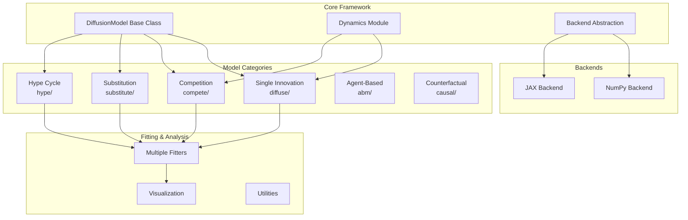
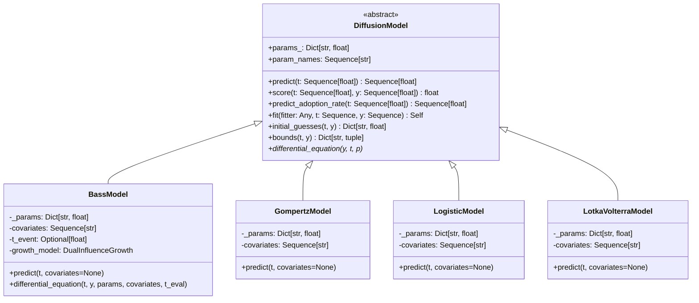
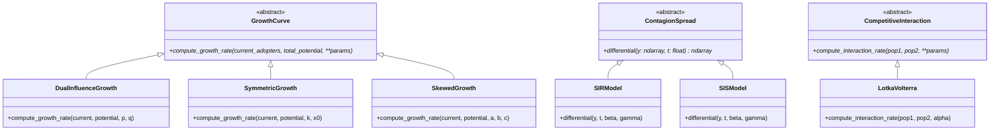
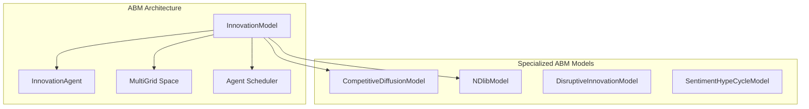
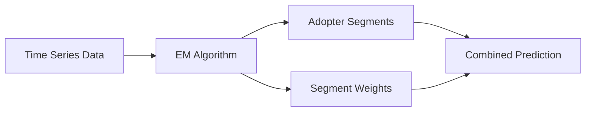
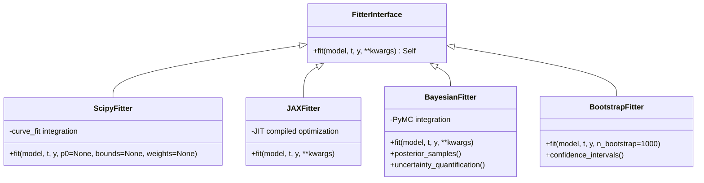
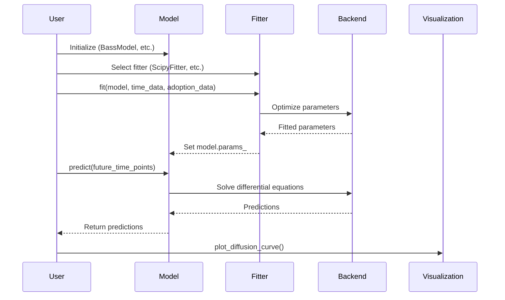
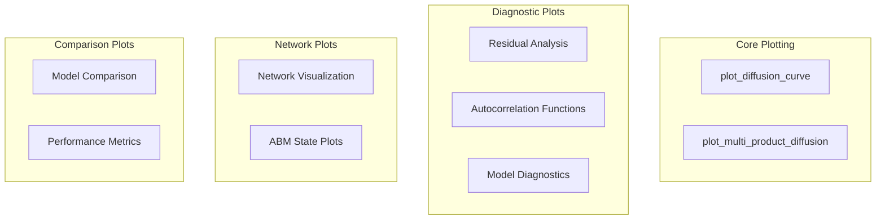
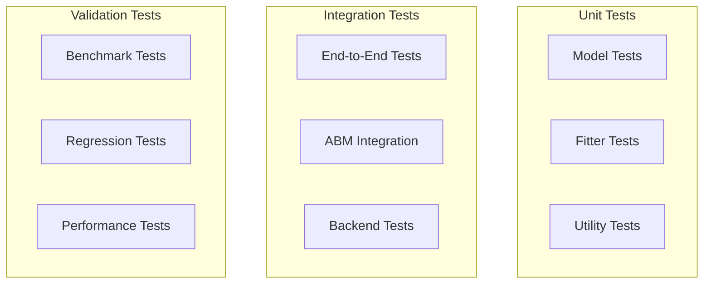

# Innovate Library Design Documentation

## Overview

The `innovate` library is a comprehensive Python framework for modeling innovation and policy diffusion dynamics. It provides a unified, modular architecture that integrates classical diffusion models, competitive dynamics, agent-based modeling, and advanced statistical techniques under a single framework.

**Version**: 0.4.1
**License**: Apache 2.0
**Python Requirements**: >=3.8

### Core Philosophy

- **Unified Framework**: Seamlessly combines mathematical models with agent-based simulations
- **Modular Architecture**: Focused modules for specific modeling tasks
- **Backend Agnostic**: Supports both NumPy and JAX backends for performance optimization
- **Extensible Design**: Clear base classes enable easy addition of custom models
- **Scikit-learn Style API**: Consistent `fit/predict/score` interface across all models

## Architecture

### System Architecture Overview



### Module Structure

The library is organized into specialized modules, each targeting specific innovation modeling scenarios:

| Module | Purpose | Key Models |
|--------|---------|------------|
| `innovate.diffuse` | Single innovation adoption curves | Bass, Gompertz, Logistic |
| `innovate.substitute` | Technology replacement patterns | Fisher-Pry, Norton-Bass |
| `innovate.compete` | Market competition dynamics | Lotka-Volterra, Multi-Product |
| `innovate.hype` | Sentiment and hype cycles | Gartner Hype Cycle, Modified Bass |
| `innovate.abm` | Agent-based simulations | Mesa integration, Network diffusion |
| `innovate.dynamics` | Core mathematical behaviors | Growth curves, Competition, Contagion |
| `innovate.fitters` | Parameter estimation | SciPy, JAX, Bayesian, Bootstrap |
| `innovate.plots` | Visualization tools | Diffusion curves, Diagnostics, Networks |

## Component Architecture

### Base Classes and Interfaces

#### DiffusionModel Abstract Base Class



#### Dynamics Module Architecture

The `innovate.dynamics` module provides functional abstractions for mathematical behaviors:



### Backend Architecture

The library supports multiple computational backends through a unified interface:

```mermaid
graph LR
    subgraph "Backend Interface"
        Current[current_backend]
        Switch[use_backend()]
    end

    subgraph "NumPy Backend"
        NumPyOps[Array Operations]
        ScipyODE[SciPy ODE Solver]
        NumPyInterp[Interpolation]
    end

    subgraph "JAX Backend"
        JAXOps[JAX Array Operations]
        DiffraxODE[Diffrax ODE Solver]
        JAXInterp[JAX Interpolation]
        JIT[JIT Compilation]
    end

    Current --> NumPyOps
    Current --> JAXOps
    Switch --> Current
```

**Backend Features:**
- **NumPy Backend**: Default, using SciPy for ODE solving
- **JAX Backend**: High-performance with JIT compilation and GPU support
- **Automatic Fallback**: Graceful degradation when JAX dependencies are missing

## Model Categories

### Single Innovation Diffusion Models

#### Bass Model (DualInfluenceGrowth)
Models adoption through innovation (p) and imitation (q) effects:

**Differential Equation**: `dN/dt = (p + q*N/m) * (m - N)`

**Parameters**:
- `p`: Innovation coefficient (external influence)
- `q`: Imitation coefficient (internal influence)
- `m`: Market potential (maximum adopters)

**Advanced Features**:
- Covariate-driven parameters
- Time-varying parameters (structural breaks)
- Mixture model support

#### Gompertz Model (SkewedGrowth)
Asymmetric S-curve with slower initial growth:

**Parameters**:
- `a`: Upper asymptote
- `b`: Displacement parameter
- `c`: Growth rate parameter

#### Logistic Model (SymmetricGrowth)
Symmetric S-curve for balanced growth patterns:

**Parameters**:
- `L`: Carrying capacity
- `k`: Growth rate
- `x0`: Midpoint

### Competition Models

#### Lotka-Volterra Model
Models competitive interaction between two technologies:

**System of Equations**:
```
dN1/dt = α1*N1 - β1*N1*N2
dN2/dt = α2*N2 - β2*N1*N2
```

**Parameters**:
- `α1, α2`: Growth rates
- `β1, β2`: Competition coefficients

#### Multi-Product Diffusion Model
Generalized framework for N competing products:

**Features**:
- Flexible interaction matrix (Q)
- Individual market potentials
- Cross-product influence modeling

### Substitution Models

#### Fisher-Pry Model
Models complete substitution between old and new technologies using logistic curves.

#### Norton-Bass Model
Extends Bass model for successive technology generations with overlapping lifecycles.

### Agent-Based Models

#### Integration with Mesa Framework


**ABM Components**:
- **InnovationAgent**: Base agent with adoption decision logic
- **CompetitiveDiffusionAgent**: Multi-innovation adoption scenarios
- **Network Integration**: Uses NDlib for network-based diffusion
- **Spatial Dynamics**: Mesa's MultiGrid for geographic spread

### Advanced Model Features

#### Mixture Models
Automatically identify distinct adopter segments using EM algorithm:



#### Hierarchical Models
Multi-level modeling for nested data structures (regions, demographics, etc.)

#### Covariate Integration
Parameters as functions of external variables:
- `p(t) = p₀ + β_p * covariate(t)`
- `q(t) = q₀ + β_q * covariate(t)`
- `m(t) = m₀ + β_m * covariate(t)`

## Fitting and Estimation Framework

### Fitter Architecture



### Supported Fitting Methods

| Fitter | Backend | Use Case | Features |
|--------|---------|----------|-----------|
| ScipyFitter | NumPy | General purpose | Robust, well-tested |
| JAXFitter | JAX | High performance | JIT compilation, GPU support |
| BayesianFitter | PyMC | Uncertainty quantification | Full posterior distribution |
| BootstrapFitter | NumPy/JAX | Confidence intervals | Non-parametric uncertainty |
| MOMFitter | NumPy | Method of moments | Fast initial estimates |

## Data Flow and Processing

### Typical Usage Workflow



### Data Processing Pipeline

1. **Data Validation**: Ensure time series is sorted, non-negative, cumulative
2. **Parameter Initialization**: Model-specific initial guesses and bounds
3. **Optimization**: Backend-specific parameter estimation
4. **Validation**: Check parameter feasibility and model convergence
5. **Prediction**: Generate forecasts using fitted parameters

## Visualization and Analysis

### Plotting System Architecture



### Available Visualizations

- **Diffusion Curves**: Observed vs predicted adoption curves
- **Multi-Product**: Competitive diffusion across multiple products
- **Residual Analysis**: Model fit diagnostics with ACF/PACF
- **Network Visualization**: Agent networks and diffusion patterns
- **Performance Comparison**: Model selection metrics (AIC/BIC/R²)

## Backend Performance and Optimization

### Computational Architecture

The library supports two computational backends optimized for different scenarios:

| Backend | Strengths | Use Cases |
|---------|-----------|-----------|
| **NumPy** | Mature, stable, broad compatibility | Development, small datasets, production |
| **JAX** | JIT compilation, GPU/TPU support | Large datasets, complex models, research |

### Performance Benchmarks

Based on internal benchmarking results:

| Model | Task | NumPy Time | JAX Time | Speedup |
|-------|------|------------|----------|---------|
| BassModel | Fit | 1.53s | 1.39s | 1.1x |
| BassModel | Predict | 0.06s | 0.06s | 1.0x |
| BassModel | Simulate 1000x | 0.64s | 0.62s | 1.03x |

**Optimization Features**:
- Vectorized operations throughout
- JIT compilation for JAX backend
- Memory-efficient ODE solving
- Batch processing support

## Extension Points and Customization

### Creating Custom Models

The base `DiffusionModel` class provides a template for implementing new diffusion models:

```python
class CustomModel(DiffusionModel):
    def predict(self, t):
        # Implementation required

    def differential_equation(self, y, t, params):
        # Define your model's ODE

    def initial_guesses(self, t, y):
        # Parameter initialization logic

    def bounds(self, t, y):
        # Parameter bounds for optimization
```

### Custom Fitters

Implement domain-specific fitting algorithms by inheriting from the fitter interface:

```python
class CustomFitter:
    def fit(self, model, t, y, **kwargs):
        # Custom optimization logic
        # Set model.params_
        return self
```

### Adding New Dynamics

Extend the dynamics module with new mathematical behaviors:

```python
class CustomGrowth(GrowthCurve):
    def compute_growth_rate(self, current_adopters, total_potential, **params):
        # Implementation of growth dynamics
```

## Integration Ecosystem

### External Library Integration

The library integrates seamlessly with the broader Python scientific ecosystem:

- **Mesa**: Agent-based modeling framework
- **NDlib**: Network diffusion library
- **NetworkX**: Network analysis and visualization
- **PyMC**: Bayesian statistical modeling
- **JAX**: High-performance numerical computing
- **Pandas/Arrow**: Efficient data handling
- **Matplotlib/Seaborn**: Visualization

### Comparison with Ecosystem

| Library | Focus | Innovate Advantage |
|---------|-------|-------------------|
| PyDiM/bassmodeldiffusion | Bass model only | Multi-model framework |
| Mesa/AgentPy | Generic ABM | Domain-specific ABM + mathematical models |
| BPTK-Py | System dynamics | Broader innovation focus |

## Testing Strategy

### Test Architecture



### Test Coverage Areas

- **Model Accuracy**: Verify mathematical implementations
- **Fitting Robustness**: Test parameter estimation across scenarios
- **Backend Compatibility**: Ensure NumPy/JAX parity
- **Integration Stability**: Test external library interactions
- **Performance Regression**: Monitor computational performance
- **Edge Cases**: Handle boundary conditions and error states

The comprehensive test suite includes 25+ test modules covering all major functionality with both synthetic and real-world data validation.
