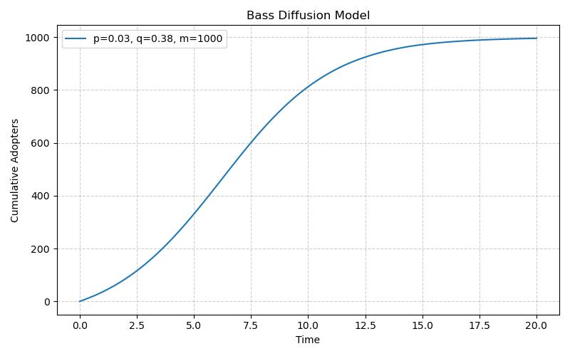
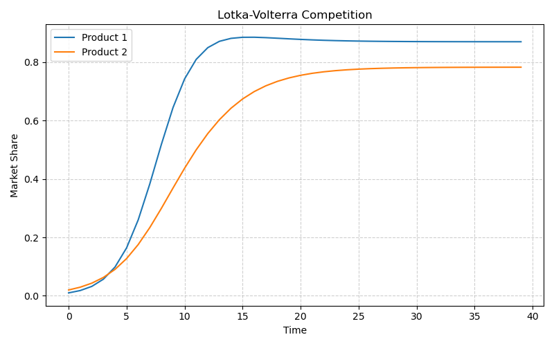
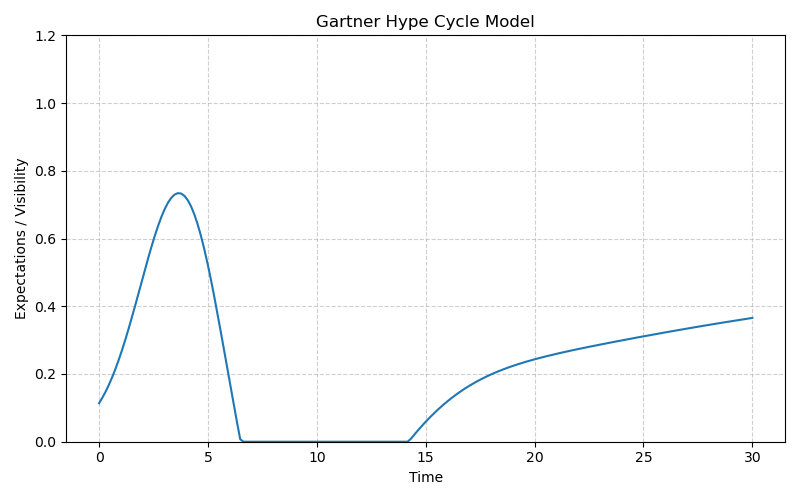
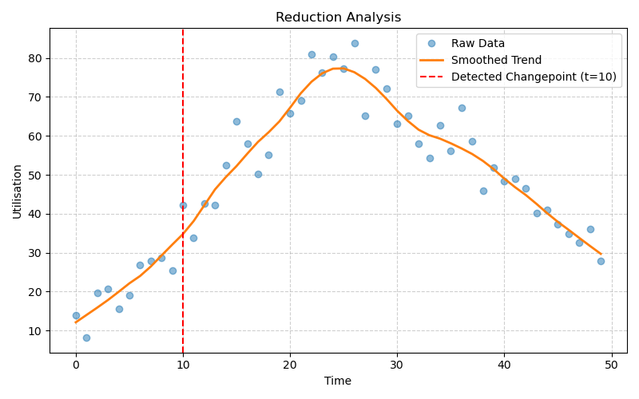
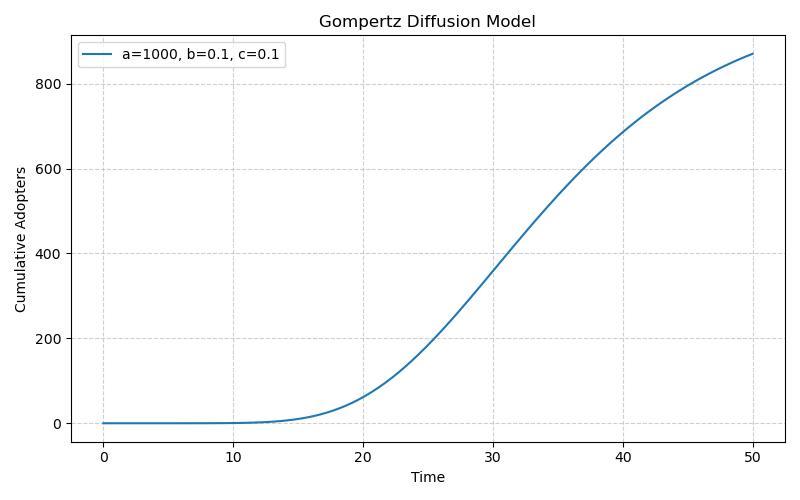
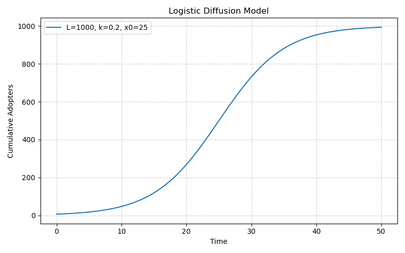
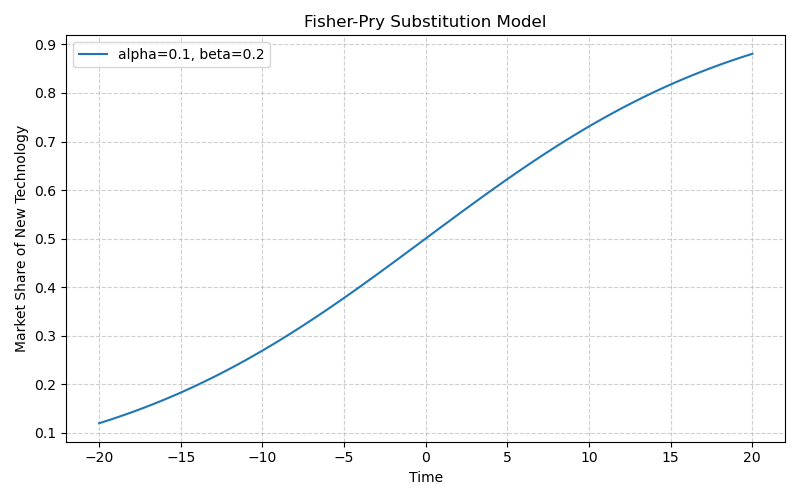
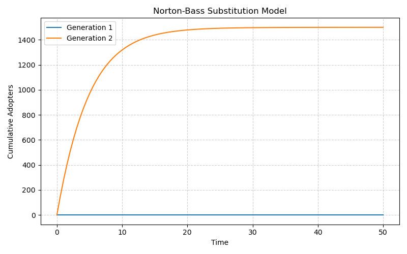
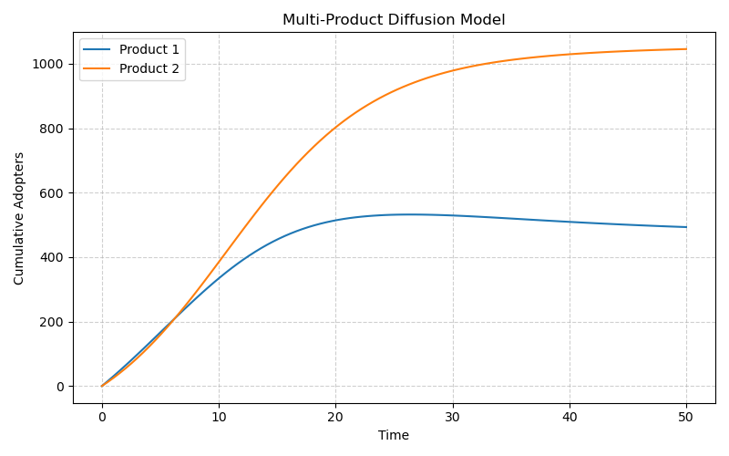
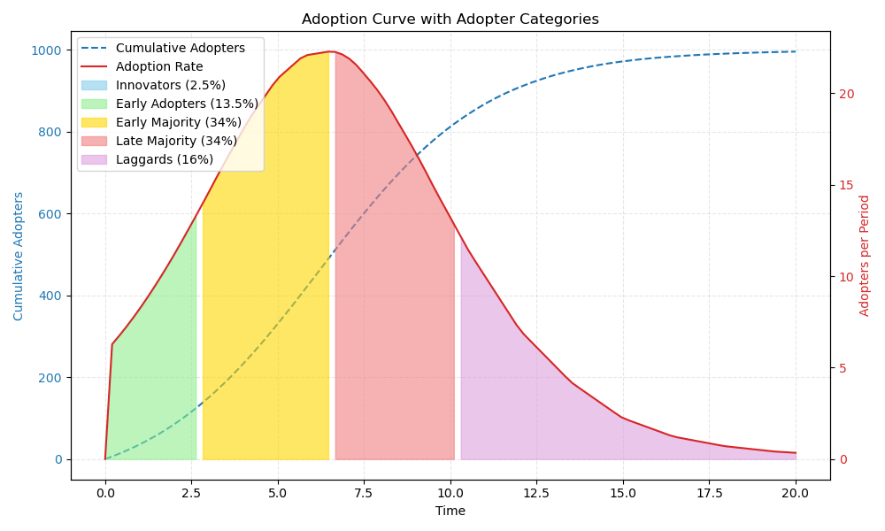

# innovate

A Python library for simplifying innovation and policy diffusion modeling.

This library provides a flexible and robust framework for modeling the complex dynamics of how innovations, technologies, and policies spread over time. It is designed for researchers and practitioners in economics, marketing, public policy, and technology forecasting.

## Core Philosophy

`innovate` is built on a modular architecture, allowing users to combine different models and components to simulate real-world scenarios. The library supports everything from classic S-curve models to advanced agent-based simulations.

## Key Features

*   **Modular Design**: A suite of focused modules for specific modeling tasks:
    *   `innovate.diffuse`: For foundational single-innovation adoption curves (Bass, Gompertz, Logistic).
    *   `innovate.substitute`: For modeling technology replacement and generational products (Fisher-Pry, Norton-Bass).
    *   `innovate.compete`: For analyzing market share dynamics between competing innovations.
    *   `innovate.hype`: For simulating the Gartner Hype Cycle and the impact of public sentiment.
    *   `innovate.fail`: For understanding the mechanisms of failed adoption.
    *   `innovate.adopt`: For classifying adopter types based on their adoption timing.
*   **Efficient Data Handling**: Uses pandas as the primary user-facing DataFrame API, with PyArrow as the columnar infrastructure layer. Polars may be used selectively for ETL-heavy paths, but it is not the contract surface.
*   **Advanced Parameterization**:
    *   **Covariate-Driven Parameters**: Allow model parameters (like `p`, `q`, and `m` in the Bass model) to be functions of external variables (e.g., price, advertising).
    *   **Time-Varying Parameters**: Model structural breaks and policy impacts by allowing parameters to change at a specified time.
    *   **Mixture Models**: Automatically identify and model distinct adopter segments from your data using the Expectation-Maximization algorithm.
*   **Extensible**: Designed with clear base classes to make it easy to add new custom models.
*   **Computationally Aware**: Leverages vectorized NumPy operations for efficiency, with a backend abstraction that will support future acceleration (e.g., with JAX).

## Model Feature Matrix

| Feature | Bass | Gompertz | Logistic | Fisher-Pry | Norton-Bass |
|---|---|---|---|---|---|
| **Core Diffusion** | ✅ | ✅ | ✅ | ✅ | ✅ |
| **Covariates** | ✅ | ✅ | ✅ | ❌ | ❌ |
| **Time-Varying Params** | ✅ | ✅ | ✅ | ❌ | ❌ |
| **Mixture Model** | ✅ | ✅ | ✅ | ❌ | ❌ |

## Available Models by Category

### Diffusion Models
* `innovate.diffuse`: Bass, Gompertz, Logistic models
* `innovate.substitute`: Fisher-Pry, Norton-Bass substitution models

### Competition & Dynamics Models  
* `innovate.compete`: Multi-product diffusion with competition effects
* `innovate.dynamics.competition`: Lotka-Volterra, Market Share Attraction, Replicator Dynamics
* `innovate.dynamics.contagion`: SIR, SIS, SEIR models

## Innovate in the Ecosystem

`innovate` is designed to fill a unique gap in the Python ecosystem. While some libraries offer diffusion models and others provide generic agent-based modeling (ABM) frameworks, `innovate` is the first to integrate both under a unified, domain-specific toolkit for innovation dynamics.

| Feature                       | `innovate`                               | `PyDiM` / `bassmodeldiffusion`      | `Mesa` / `AgentPy` / `BPTK-Py`        |
| ----------------------------- | ---------------------------------------- | ----------------------------------- | ------------------------------------- |
| **Core Diffusion Models**     | ✅ (Bass, Gompertz, Logistic)            | ✅ (Primarily Bass)                 | ❌ (Not its focus)                    |
| **Competition Models**        | ✅ (Lotka-Volterra)                      | ❌                                  | ✅ (Via custom ABM)                   |
| **Substitution Models**       | ✅ (Fisher-Pry)                          | ❌                                  | ✅ (Via custom ABM)                   |
| **Hype Cycle Modeling**       | ✅ (Composite & DDE models)              | ❌                                  | ✅ (Via custom ABM)                   |
| **Advanced Parameterization** | ✅ (Covariates, Time-Varying, Mixtures)  | ❌                                  | ❌ (Requires manual implementation)   |
| **Agent-Based Modeling**      | ✅ (Integrated with `mesa`)              | ❌                                  | ✅ (Core functionality)               |
| **Pre-configured ABM Scenarios**| ✅ (Competition, Hype, Disruption)       | ❌                                  | ❌ (Requires manual implementation)   |
| **System Dynamics**           | ❌                                       | ❌                                  | ✅ (BPTK-Py only)                     |
| **Unified Framework**         | ✅ (Diffusion + Competition + ABM)       | ❌ (Focused on diffusion)           | ❌ (Focused on ABM/SD)                |
| **Parameter Fitting**         | ✅                                       | ✅                                  | ❌ (Not a primary feature)            |
| **Visualization**             | ✅                                       | ✅                                  | ✅ (Network/Grid plots)               |

This integrated approach means you can start with high-level diffusion models and seamlessly transition to complex, bottom-up agent-based simulations without changing frameworks.

## Roadmap

The `innovate` library is under active development. For the broader product roadmap, see [Roadmap](documents/roadmap.md). For the architecture direction that governs portability, bindings, and backend evolution, see [Architecture Principles](docs/architecture_principles.md), [Architecture Modernization Roadmap](docs/architecture_modernization_roadmap.md), and the [ADR index](docs/adr/index.md).

## Codex Automation

This repository vendors the Conductor skills that define its autonomous implementation workflow under [`.codex/skills`](.codex/skills/README.md). If you are using Codex locally, sync the repo-managed copies into your active Codex home with:

```bash
uv run python scripts/sync_codex_skills.py
```

The sync step installs the project-owned versions of `conductor`, `conductor-setup`, `conductor-status`, `conductor-revert`, `conductor-newtrack`, `conductor-implement`, and `conductor-review`, which keeps the Conductor workflow portable across machines and consistent with this repository's documented automation contract.

## Installation

### Using uv (Recommended)

```bash
# Clone and install with uv
git clone https://github.com/edithatogo/innovate.git
cd innovate
uv sync
```

For development with all tooling:
```bash
uv sync --extra jax --extra bayesian
```

The optional backend extras are intentionally split:

```bash
uv sync
uv sync --extra jax
uv sync --extra bayesian
```

### Using pip

```bash
pip install innovate
```
*(Note: The package is not yet available on PyPI under this name, but will be in the future).*

`pyarrow` is part of the base install. Install the optional extras only when you need the accelerator or Bayesian paths.

## Usage

Examples and tutorials are provided in the `examples/` directory to demonstrate how to use the library for various modeling scenarios.

### Canonical Imports

For new code, prefer the stable package-level imports:

```python
from innovate import BassModel, LogisticModel, GompertzModel, ScipyFitter
from innovate.compete import MultiProductDiffusionModel, LotkaVolterraModel
from innovate.substitute import FisherPryModel, NortonBassModel
from innovate.backends import use_backend
```

Legacy imports such as `innovate.backend` and `innovate.compete.competition` remain importable for compatibility, but the package-level imports above are the intended public surface.

Key examples include:
- `basic_usage_example.py`: Basic Bass model fitting
- `basic_usage_example.ipynb`: Comprehensive Jupyter notebook with multiple examples
- Additional examples in the `examples/` directory for specific use cases

## Example Plots

Here is a sample of the kinds of visualizations you can generate with `innovate`.

| Bass Diffusion | Lotka-Volterra Competition |
| :---: | :---: |
|  |  |

| Hype Cycle | Reduction Analysis |
| :---: | :---: |
|  |  |

| Gompertz Diffusion | Logistic Diffusion |
| :---: | :---: |
|  |  |

| Fisher-Pry Substitution | Norton-Bass Substitution |
| :---: | :---: |
|  |  |

| Multi-Product Diffusion | Adoption Curve |
| :---: | :---: |
|  |  |


## Backend Performance

The `innovate` library supports both NumPy and JAX backends. NumPy/SciPy is the reference runtime; JAX is an optional accelerator that can improve fitting for more demanding workloads. Bayesian fitters are also optional and require the dedicated `bayesian` extra.

To install the accelerator and Bayesian stacks:

```bash
uv sync --extra jax --extra bayesian
```

Use `uv sync --extra jax` when you only want the accelerator path, and `uv sync --extra bayesian` when you only want the Bayesian path.

The following table shows the results of a benchmarking script that compares the performance of the NumPy and JAX backends for a variety of tasks:

| Model | Backend | Task | Time (s) |
|---|---|---|---|
| BassModel | numpy | fit | 1.53 |
| BassModel | jax | fit | 1.39 |
| GompertzModel | numpy | fit | 0.03 |
| GompertzModel | jax | fit | 0.03 |
| LogisticModel | numpy | fit | 0.05 |
| LogisticModel | jax | fit | 0.05 |
| BassModel | numpy | predict | 0.06 |
| BassModel | jax | predict | 0.06 |
| GompertzModel | numpy | predict | 0.06 |
| GompertzModel | jax | predict | 0.06 |
| LogisticModel | numpy | predict | 0.10 |
| LogisticModel | jax | predict | 0.10 |
| BassModel | numpy | simulate_1000 | 0.64 |
| BassModel | jax | simulate_1000 | 0.62 |
| GompertzModel | numpy | simulate_1000 | 0.61 |
| GompertzModel | jax | simulate_1000 | 0.61 |
| LogisticModel | numpy | simulate_1000 | 1.06 |
| LogisticModel | jax | simulate_1000 | 1.08 |

As you can see, the JAX backend is slightly faster than the NumPy backend for fitting the `BassModel`. However, the performance is about the same for the other models and tasks.

We are continuing to investigate opportunities for optimization, including the selective use of `pyarrow`-backed interchange and narrow Polars ingestion workflows where they materially reduce cost without changing the public API.

## License

This project is licensed under the Apache 2.0 License.

## Testing

See the [Testing Strategy](docs/testing_strategy.rst) document for details on
how to run the test suite and how different tests are categorized.

### Setup

Install the project dependencies before running the tests:

```bash
pip install -r requirements.txt
```

After installing the requirements, you can run `pytest`. The recommended base
and optional-backend commands are documented in
[docs/testing_strategy.rst](docs/testing_strategy.rst).

## Branching Strategy
This repository now uses `work` as the primary development branch. Existing branches can be rebased or merged onto `work`.
