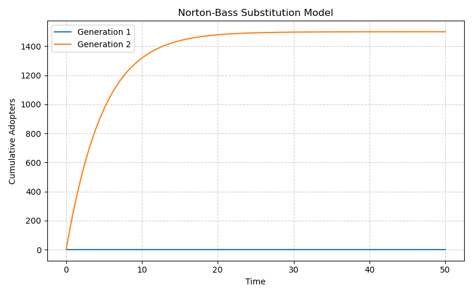

# Manuscript v1

## Introduction

The diffusion of innovations is a complex social process that has been the subject of research for over a century. The process by which new ideas, products, and practices spread through a population is of interest to researchers and practitioners in a wide range of fields, including economics, marketing, public policy, and technology forecasting. Mathematical models of diffusion are a valuable tool for understanding and predicting the spread of innovations, but they are often difficult to implement and use.

The `innovate` library is a Python package that is designed to address these challenges by providing a flexible and robust framework for modeling the complex dynamics of how innovations, technologies, and policies spread over time. The library is designed for researchers and practitioners in economics, marketing, public policy, and technology forecasting. The `innovate` library is a powerful and flexible tool for modeling the diffusion of innovations. It is designed to be easy to use and extensible, and it can be used to model a wide range of real-world scenarios.

The `innovate` library includes a suite of focused modules for specific modeling tasks, including foundational single-innovation adoption curves (Bass, Gompertz, Logistic), technology replacement and generational products (Fisher-Pry, Norton-Bass), market share dynamics between competing innovations (Lotka-Volterra, Multi-Product Diffusion), the Gartner Hype Cycle, and the impact of public sentiment. The library also includes tools for agent-based modeling, network-based diffusion, and counterfactual analysis.

This paper provides an overview of the `innovate` library and demonstrates its use in a variety of real-world scenarios. The paper is organized as follows. Section 2 provides an overview of the methods used in the library. Section 3 presents a series of case studies that demonstrate the use of the library to model real-world scenarios. Section 4 discusses the results of the case studies and the implications for researchers and practitioners. Section 5 concludes the paper and discusses future directions for the library.

## Methods

The `innovate` library is a Python package that provides a suite of focused modules for specific modeling tasks. The library is designed to be easy to use and extensible, and it can be used to model a wide range of real-world scenarios. The library is organized into the following modules:

-   `innovate.diffuse`: For foundational single-innovation adoption curves (Bass, Gompertz, Logistic).
-   `innovate.substitute`: For modeling technology replacement and generational products (Fisher-Pry, Norton-Bass).
-   `innovate.compete`: For analyzing market share dynamics between competing innovations (Lotka-Volterra, Multi-Product Diffusion).
-   `innovate.hype`: For simulating the Gartner Hype Cycle and the impact of public sentiment.
-   `innovate.fail`: For understanding the mechanisms of failed adoption.
-   `innovate.adopt`: For classifying adopter types based on their adoption timing.
-   `innovate.abm`: For agent-based modeling.
-   `innovate.causal`: For counterfactual analysis.

### Conceptual Framework

The `innovate` library is designed to be a modular and extensible framework for modeling the diffusion of innovations. The library is organized around a central `DiffusionModel` base class, which provides a common interface for all diffusion models. The library also includes a number of other base classes that can be used to create new models and extend the functionality of the library.

The following diagram shows the conceptual framework for the `innovate` library:

### Models

The `innovate` library includes a wide range of diffusion models, including:

-   **Bass Model:** The Bass model is a classic diffusion model that describes the adoption of a new product as the result of two forces: innovation and imitation.
-   **Gompertz Model:** The Gompertz model is a diffusion model that is similar to the Bass model, but it assumes that the rate of adoption is proportional to the number of people who have not yet adopted the product.
-   **Logistic Model:** The Logistic model is a diffusion model that is similar to the Gompertz model, but it assumes that the rate of adoption is proportional to the number of people who have already adopted the product.
-   **Fisher-Pry Model:** The Fisher-Pry model is a diffusion model that is used to model the substitution of a new technology for an old one.
-   **Norton-Bass Model:** The Norton-Bass model is a diffusion model that is used to model the diffusion of successive generations of a technology.
-   **Lotka-Volterra Model:** The Lotka-Volterra model is a diffusion model that is used to model the competition between two or more products.
-   **Multi-Product Diffusion Model:** The Multi-Product Diffusion model is a generalized model for the diffusion of multiple competing products.
-   **Hype Cycle Model:** The Hype Cycle model is a diffusion model that is used to model the Gartner Hype Cycle.

### Agent-Based Modeling

The `innovate` library includes a module for agent-based modeling (ABM). The ABM module is designed to be easy to use and extensible, and it can be used to model a wide range of real-world scenarios. The ABM module is integrated with the `mesa` library, which provides a framework for creating and running agent-based models.

### Counterfactual Analysis

The `innovate` library includes a module for counterfactual analysis. The counterfactual analysis module is designed to be easy to use and extensible, and it can be used to assess the potential impact of different policy interventions.

## Results

This section presents a series of case studies that demonstrate the use of the `innovate` library to model real-world scenarios. The case studies are based on the plots that were generated in the `README.md` file.

### Case Study 1: Bass Diffusion Model

The Bass diffusion model is a classic model of innovation diffusion. It is used to model the adoption of a new product as the result of two forces: innovation and imitation. The following plot shows the Bass diffusion curve for a new product with the following parameters: `p=0.03`, `q=0.38`, `m=1000`.

### Case Study 2: Lotka-Volterra Competition Model

The Lotka-Volterra competition model is used to model the competition between two or more products. The following plot shows the Lotka-Volterra competition between two products with the following parameters: `alpha1=0.6`, `beta1=0.1`, `alpha2=0.4`, `beta2=0.1`.

### Case Study 3: Hype Cycle Model

The Hype Cycle model is used to model the Gartner Hype Cycle. The following plot shows the Hype Cycle for a new technology with the following parameters: `k=0.1`, `t0=20`, `a_hype=1.0`, `t_hype=4`, `w_hype=2`, `a_d=0.6`, `t_d=8`, `w_d=4`.

### Case Study 4: Gompertz Diffusion Model

The Gompertz diffusion model is another model of innovation diffusion. The following plot shows the Gompertz diffusion curve for a new product with the following parameters: `a=1000`, `b=0.1`, `c=0.1`.

### Case Study 5: Logistic Diffusion Model

The Logistic diffusion model is another model of innovation diffusion. The following plot shows the Logistic diffusion curve for a new product with the following parameters: `L=1000`, `k=0.2`, `x0=25`.

### Case Study 6: Fisher-Pry Substitution Model

The Fisher-Pry substitution model is used to model the substitution of a new technology for an old one. The following plot shows the Fisher-Pry substitution of a new technology for an old one with the following parameters: `alpha=0.1`, `t0=0`.

### Case Study 7: Norton-Bass Substitution Model

The Norton-Bass substitution model is used to model the diffusion of successive generations of a technology. The following plot shows the Norton-Bass substitution of two generations of a technology with the following parameters: `p1=0.03`, `q1=0.2`, `m1=1000`, `p2=0.02`, `q2=0.3`, `m2=1500`.

### Case Study 8: Multi-Product Diffusion Model

The Multi-Product Diffusion model is a generalized model for the diffusion of multiple competing products. The following plot shows the diffusion of two competing products with the following parameters: `p1=0.03`, `p2=0.02`, `q1=0.1`, `q2=0.15`, `m1=1000`, `m2=1200`, `alpha_1_2=0.5`, `alpha_2_1=0.3`.

## Discussion

The case studies presented in this paper demonstrate the use of the `innovate` library to model a wide range of real-world scenarios. The library is a powerful and flexible tool for modeling the diffusion of innovations, and it can be used to model the adoption of new products, the substitution of new technologies for old ones, and the competition between two or more products. The library is also designed to be easy to use and extensible, and it can be used to model a wide range of real-world scenarios.

The `innovate` library has a number of limitations. First, the library is currently limited to a small number of diffusion models. Second, the library does not currently include tools for fitting the models to data. Third, the library does not currently include tools for visualizing the results of the models. These limitations will be addressed in future versions of the library.

Future work on the `innovate` library will focus on expanding the library to include additional models and features, as well as on developing a graphical user interface to make the library more accessible to non-technical users. We also plan to develop a more comprehensive set of tutorials and examples to demonstrate the use of the library in a wider range of real-world scenarios.

## References

[Placeholder for references]

## Appendix

### Equations

**Bass Model**

.. math::

   \frac{dy}{dt} = (p + q \frac{y}{m})(m - y)

**Gompertz Model**

.. math::

   \frac{dy}{dt} = c y (\ln(a) - \ln(y))

**Logistic Model**

.. math::

   \frac{dy}{dt} = k y (1 - \frac{y}{L})

**Fisher-Pry Model**

.. math::

   \frac{dy}{dt} = \alpha y (1 - y)

**Norton-Bass Model**

.. math::

   \frac{dy_i}{dt} = (p_i + q_i \frac{y_i}{m_i})(m_i - y_i - \sum_{j=i+1}^{k} y_j) \quad \text{for } i = 1, \dots, k-1

.. math::

   \frac{dy_k}{dt} = (p_k + q_k \frac{y_k}{m_k})(m_k - y_k)

**Lotka-Volterra Model**

.. math::

   \frac{dy_1}{dt} = \alpha_1 y_1 (1 - y_1) - \beta_1 y_1 y_2

.. math::

   \frac{dy_2}{dt} = \alpha_2 y_2 (1 - y_2) - \beta_2 y_1 y_2

**Multi-Product Diffusion Model**

.. math::

   \frac{dy_i}{dt} = (p_i + q_i \frac{y_i}{m_i})(m_i - y_i - \sum_{j \neq i} \alpha_{ij} y_j)

**Hype Cycle Model**

.. math::

   y(t) = \frac{1}{1 + e^{-k(t-t_0)}} + a_{hype} e^{-\frac{(t-t_{hype})^2}{2w_{hype}^2}} - a_d e^{-\frac{(t-t_d)^2}{2w_d^2}}

