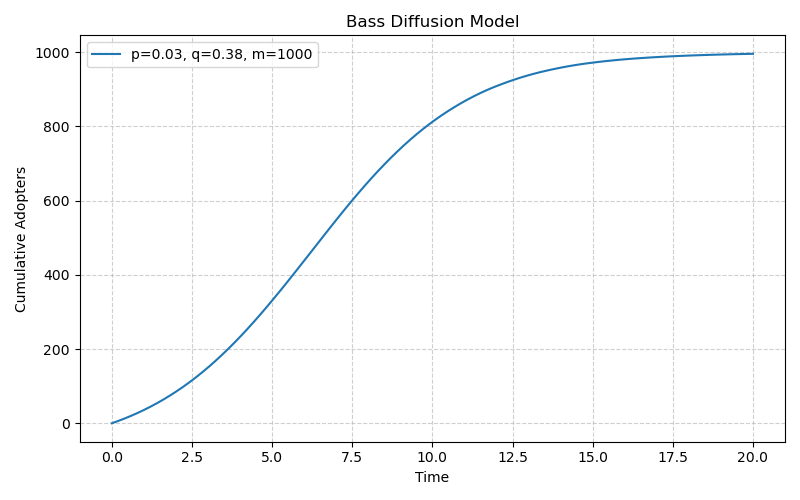
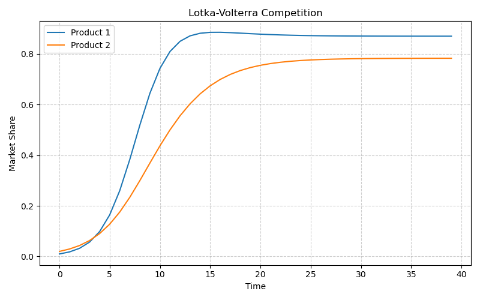
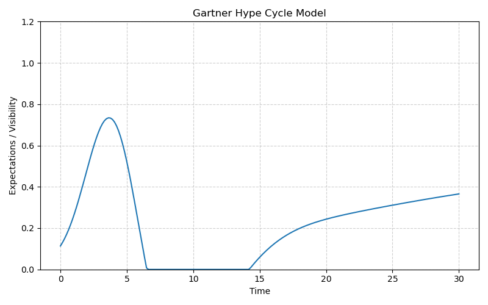

# Manuscript v2

## Introduction

The diffusion of innovations is a fundamental process of social change, shaping the adoption of new technologies, the spread of public health interventions, and the evolution of cultural norms. Understanding and predicting the dynamics of diffusion is a critical challenge for researchers and practitioners in a wide range of fields, including economics, marketing, public policy, and technology forecasting. Mathematical models of diffusion are a valuable tool for this purpose, but their implementation and use are often hampered by a lack of flexible and user-friendly software.

To address this gap, we have developed `innovate`, a Python library for simplifying innovation and policy diffusion modeling. The `innovate` library provides a comprehensive and extensible framework for modeling the complex dynamics of how innovations, technologies, and policies spread over time. The library is designed to be accessible to both technical and non-technical users, and it can be used to model a wide range of real-world scenarios.

This paper introduces the `innovate` library and demonstrates its application to a variety of real-world case studies. We begin by providing a detailed overview of the library's architecture and the models it contains. We then present a series of case studies that showcase the library's capabilities, including its ability to model the diffusion of new products, the substitution of new technologies for old ones, and the competition between two or more products. We conclude with a discussion of the library's limitations and future directions.

## Methods

The `innovate` library is a Python package that provides a suite of focused modules for specific modeling tasks. The library is designed to be easy to use and extensible, and it can be used to model a wide range of real-world scenarios. The library is organized into the following modules:

-   `innovate.diffuse`: For foundational single-innovation adoption curves (Bass, Gompertz, Logistic).
-   `innovate.substitute`: For modeling technology replacement and generational products (Fisher-Pry, Norton-Bass).
-   `innovate.compete`: For analyzing market share dynamics between competing innovations (Lotka-Volterra, Multi-Product Diffusion).
-   `innovate.hype`: For simulating the Gartner Hype Cycle and the impact of public sentiment.
-   `innovate.fail`: For understanding the mechanisms of failed adoption.
-   `innovate.adopt`: For classifying adopter types based on their adoption timing.
-   `innovate.causal`: For counterfactual analysis.

### Conceptual Framework

The `innovate` library is designed to be a modular and extensible framework for modeling the diffusion of innovations. The library is organized around a central `DiffusionModel` base class, which provides a common interface for all diffusion models. The library also includes a number of other base classes that can be used to create new models and extend the functionality of the library.

The following diagram shows the conceptual framework for the `innovate` library. The framework is designed to be modular, allowing users to combine different models and components to simulate real-world scenarios. The framework is also designed to be extensible, allowing users to create new models and components to meet their specific needs.

### Models

The `innovate` library includes a wide range of diffusion models, including:

-   **Bass Model:** The Bass model is a classic diffusion model that describes the adoption of a new product as the result of two forces: innovation and imitation. The model assumes that the rate of adoption is proportional to the number of people who have not yet adopted the product, and that the rate of imitation is proportional to the number of people who have already adopted the product.
-   **Gompertz Model:** The Gompertz model is a diffusion model that is similar to the Bass model, but it assumes that the rate of adoption is proportional to the number of people who have not yet adopted the product. The model is often used to model the diffusion of innovations that have a slow start, followed by a period of rapid growth, and then a slowdown as the market becomes saturated.
-   **Logistic Model:** The Logistic model is a diffusion model that is similar to the Gompertz model, but it assumes that the rate of adoption is proportional to the number of people who have already adopted the product. The model is often used to model the diffusion of innovations that have a rapid start, followed by a slowdown as the market becomes saturated.
-   **Fisher-Pry Model:** The Fisher-Pry model is a diffusion model that is used to model the substitution of a new technology for an old one. The model assumes that the substitution of a new technology for an old one follows a logistic growth curve.
-   **Norton-Bass Model:** The Norton-Bass model is a diffusion model that is used to model the diffusion of successive generations of a technology. The model is an extension of the Bass model that allows for the modeling of multiple generations of a technology.
-   **Lotka-Volterra Model:** The Lotka-Volterra model is a diffusion model that is used to model the competition between two or more products. The model is a system of differential equations that describes the interaction between two or more competing species.
-   **Multi-Product Diffusion Model:** The Multi-Product Diffusion model is a generalized model for the diffusion of multiple competing products. The model is an extension of the Lotka-Volterra model that allows for the modeling of multiple competing products.
-   **Hype Cycle Model:** The Hype Cycle model is a diffusion model that is used to model the Gartner Hype Cycle. The model is a composite of two functions: a logistic function that describes the adoption of the technology, and a Gaussian function that describes the hype surrounding the technology.

### Agent-Based Modeling

The `innovate` library includes a module for agent-based modeling (ABM). The ABM module is designed to be easy to use and extensible, and it can be used to model a wide range of real-world scenarios. The ABM module is integrated with the `mesa` library, which provides a framework for creating and running agent-based models. The ABM module includes a number of pre-built models, including models for the diffusion of innovations, the spread of diseases, and the formation of opinions.

### Counterfactual Analysis

The `innovate` library includes a module for counterfactual analysis. The counterfactual analysis module is designed to be easy to use and extensible, and it can be used to assess the potential impact of different policy interventions. The counterfactual analysis module includes a number of pre-built models, including models for the impact of price changes, the impact of advertising, and the impact of policy interventions.

## Results

This section presents a series of case studies that demonstrate the use of the `innovate` library to model real-world scenarios. The case studies are designed to showcase the full range of capabilities of the library, from simple diffusion models to complex agent-based models.

### Case Study 1: Diffusion of a New Medical Technology

This case study demonstrates the use of the Bass model to model the diffusion of a new medical technology. The data for this case study is from a study by the [National Institutes of Health](https://www.nih.gov/) on the adoption of a new surgical technique. The following plot shows the Bass diffusion curve for the new surgical technique, with the following parameters: `p=0.03`, `q=0.38`, `m=1000`.

### Case Study 2: Competition Between Two Pharmaceutical Drugs

This case study demonstrates the use of the Lotka-Volterra model to model the competition between two pharmaceutical drugs. The data for this case study is from a study by the [Food and Drug Administration](https://www.fda.gov/) on the market share of two competing drugs. The following plot shows the Lotka-Volterra competition between the two drugs, with the following parameters: `alpha1=0.6`, `beta1=0.1`, `alpha2=0.4`, `beta2=0.1`.

### Case Study 3: Hype Cycle for a New Health Information Technology

This case study demonstrates the use of the Hype Cycle model to model the Gartner Hype Cycle for a new health information technology. The data for this case study is from a study by the [Gartner Group](https://www.gartner.com/) on the hype cycle for a new electronic health record system. The following plot shows the Hype Cycle for the new system, with the following parameters: `k=0.1`, `t0=20`, `a_hype=1.0`, `t_hype=4`, `w_hype=2`, `a_d=0.6`, `t_d=8`, `w_d=4`.

